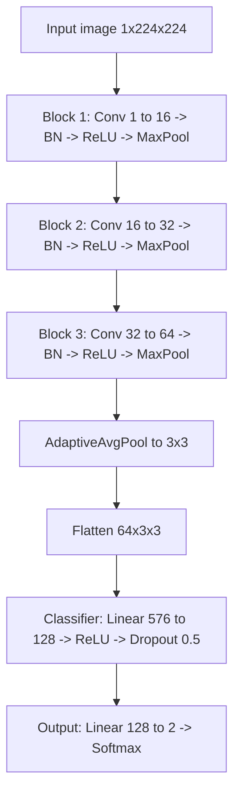

# IDS705_ML_Final_Project_Group10
Investigating the vulnerability of medical imaging AI to adversarial attacks.

## Custom CNN: DASYNET (PneumoniaMNIST)

This repository includes a custom CNN model named DASYNET for binary classification on the PneumoniaMNIST dataset (normal vs. pneumonia).

Notebook:
- [DASYNET_PneumoniaMNIST.ipynb](DASYNET_PneumoniaMNIST.ipynb)

### Model Architecture

DASYNET is a lightweight convolutional network with three feature extraction blocks followed by a classifier:

1. Conv2d (1 -> 16, kernel 3, padding 1) + BatchNorm + ReLU + MaxPool
2. Conv2d (16 -> 32, kernel 3, padding 1) + BatchNorm + ReLU + MaxPool
3. Conv2d (32 -> 64, kernel 3, padding 1) + BatchNorm + ReLU + MaxPool
4. AdaptiveAvgPool2d (3x3)
5. Flatten
6. Linear (64x3x3 -> 128) + ReLU + Dropout(0.5)
7. Linear (128 -> num_classes)

### Training Setup

- Dataset: PneumoniaMNIST from MedMNIST
- Input size used in notebook: 224x224 grayscale (`size=IMG_SIZE`, with `IMG_SIZE=224`)
- Source resolution note: PneumoniaMNIST is originally 28x28 and is upscaled by the MedMNIST dataset loader when `size=224` is requested
- Transform: ToTensor + Normalize(mean=0.5, std=0.5)
- Device handling: runtime CUDA check with automatic CPU fallback when CUDA is unavailable or incompatible
- Batch size: 128 on CUDA, 32 on CPU
- Loss: CrossEntropyLoss
- Optimizer: AdamW (learning rate 1e-3, weight decay 1e-4)
- Scheduler: ReduceLROnPlateau (factor 0.5, patience 3)
- Epochs: 35

### Evaluation Notes

The training loader uses shuffle=True for optimization, while evaluation uses non-shuffled loaders. This is important for correct MedMNIST evaluator alignment when computing train/test metrics.

### Saved Output

After training, model weights are saved to:
- dasynet_pneumonia.pth

### How To Run (VS Code + Colab Runtime)

1. Open [DASYNET_PneumoniaMNIST.ipynb](DASYNET_PneumoniaMNIST.ipynb).
2. Connect VS Code notebook to your Colab runtime.
3. Run Cell 2 to install MedMNIST.
4. Run Cell 3 to train and evaluate DASYNET.
5. Run Cell 4 to save weights.

### Related Benchmark Notebook

The file [All_MedMNIST_Resampling_Benchmark_backup_2026-04-11.ipynb](All_MedMNIST_Resampling_Benchmark_backup_2026-04-11.ipynb) benchmarks all 12 MedMNIST 2D datasets and is kept separate from the single-dataset DASYNET pipeline.

In that benchmark notebook, 224 is explicitly defined and used throughout via:
- `SIZE = 224` for preprocessing and perturbation steps
- dataset assets named with `_224` (downloaded and cached)
- model weights named with `resnet18_224`
